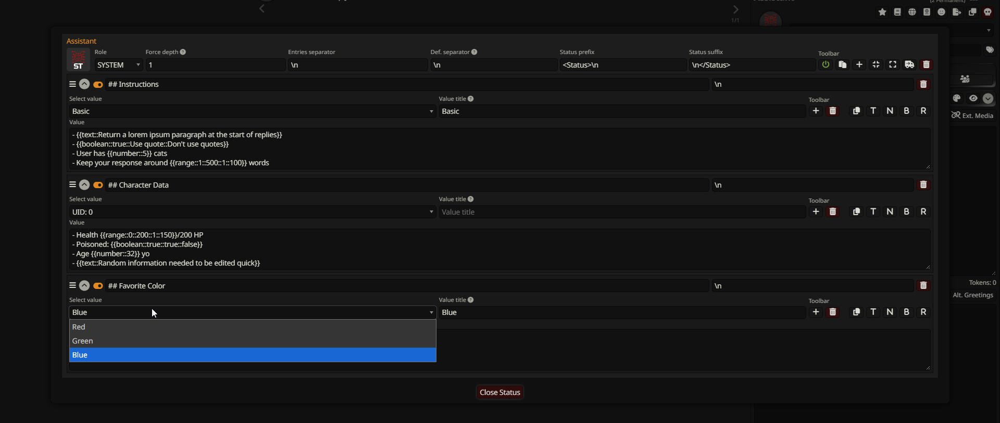
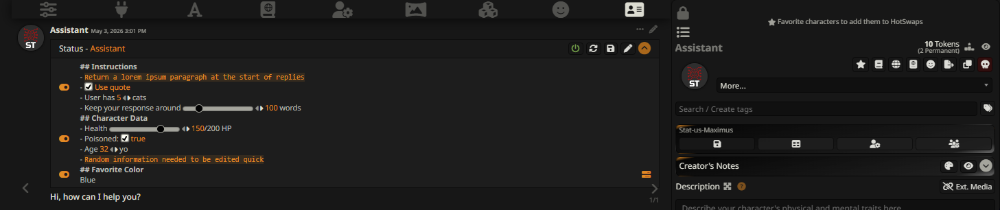

# Stat-us Maximus
This extension adds a prompt shortcut for your chats. Think of it as a Prompt Manager individual for each character, that is saved per char and only sent if the character is present (or always for individual chats). The extension is not automated by an AI in the background, it adds UI elements in chat to allow you to easily edit everything by hand, and it also gives you slash commands that allow you to edit every field of the status blocks, if you want to add automation/AI automation by yourself via ST Scripts.
This is not focused for any task in particular, it's all just text, put what you want.




## Features

### Status
- When you open a chat, a status will be added for every character present.
- A table with all of the character stats will be added in the last message of the character (entries created needed).
- The table can be collapsed to save space (the collapsed state saves).
- Every character status is sent in a dynamic depth that will adjust to be on top of the last character message, it can be overriden to be sent at a specific depth.
- The status can use the roles `system`, `user` or `assistant` - defaults to `system`.
- With macros, you can set inputs in the chat UI to quick edit entries without opening menus.
- You can set swipes (alt values) for each stat entry.
- You can transfer entries between characters from the popup Menu (truck button).
- You can copy and paste entries via clipboard from the popup Menu.

### Menus
**Magic wand button** - From the magic wand button (left to the input bar), you can open a popup menu to manage every character status in existence.
**Character Management menu** - From the Character Management menu, you can open a popup menu for the active chat characters statuses. You can also open a popup for your personas; one button for active persona, and another for all personas with status data.
**Group Management menu** - In group chats, click the member avatar in the Current Members dropdown to open its status popup menu.
**All chats** - In all chats, click the pen icon at the corner of the status table, placed in the last message of each character, to open its popup menu.

### Slash Commands
- `/stum-create-status` Creates Status data for the selected character, allows you to add data for non-present chat participants.
- `/stum-set-status-field` Sets the value of one of the core fields of you Character's status. If you use ST's macros as the field value, you'll need to escape them like this: `{\{char}}`.
- `/stum-delete-status` Deletes Status data for the selected character.
- `/stum-create-entry` Creates an entry in the status of a character and returns its UID. If the character is not found in the metadata, it returns false.
- `/stum-get-entry-uid` Get an entry uid by pairing a Character status field against a value, returning the uid of the first match. If no match is found, an empty string is returned.
- `/stum-set-entry-field` Updates the value of the Status Entry field of a Character.
- `/stum-get-entry-field` Get the value of the Status Entry field of a Character. If no match is found, an empty string is returned.
- `/stum-delete-entry` Deletes an Status Entry from a Character.
- `/stum-switch-entry-value` Switches the entry value by one of the entry alt values.
- `/stum-create-alt-entry-value` Adds a new alt value to the selected entry. Returns the alt value uid.
- `/stum-get-alt-entry-uid` Get the UID of an alt entry value by pairing a field against a value, returning the uid of the first match. If no match is found, an empty string is returned.
- `/stum-set-alt-entry-field` Updates the field value of one of the Status Entry alt descriptions.
- `/stum-get-alt-entry-field` Get the field value of one of the alt entry values. If no match is found, an empty string is returned.
- `/stum-delete-alt-entry` Deletes an alt value within a status entry.
- `/stum-delete-chat-status` It will wipe all status stored in the chat metadata - only applies to open chat.

### Macros
These macros only work inside status blocks.
- `{{name}}` Will be replaced with the name of the Status owner.
- `{{text}} | {{text::Your text here}}` In the chat UI, it will be replaced with a text input. This does not support newlines or curly braces `{}`.
- `{{number}} | {{number::2048}}` In the chat UI, it will be replaced with a number input. You need to use dots `.` for decimals, commas are not supported.
- `{{boolean}} | {{boolean::DefaultValueTrueOrFalse::Custom True Label::Custom False Label}}` In the chat UI, it will be replaced with a checkbox. The first parameter is the state of the checkbox, and must either be `true` or `false`. By default, the checkbox labels and value sent to prompt will simply be "true" or "false", but you can set custom texts to be displayed/sent instead with the custom label parameters.
- `{{range::min::max::step::value}}` In the chat UI, it will be replaced with a range input, the same used in the samplers panel. `min` is the minimum value of the range, `max` is the maximum, `step` is the amount of numbers the input will increase/decrease when the buttons of the input are used, and `value` is the value the input will have. All parameters are `numbers`, and decimals only accept dots.

## Installation
Install the extension using this link inside SillyTavern's extensions installer:
```https://github.com/leandrojofre/SillyTavern-Stat-us-Maximus.git```

### Support and Contributions
- Feel free to submit a PR with the feature you want! Make sure to read the **Contribution Rules**. As long as you follow them, any change you update will be accepted (if it's reasonable).

### Contribution Rules
- Always PR against the `staging` branch.
- Use the `staging` branch as the source of you working branch. If you create a new branch to work on your feature, make sure you use the `staging` branch as the source of the new branch.
- Nothing else really, enjoy.
